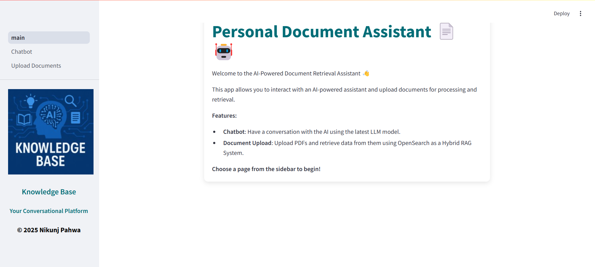
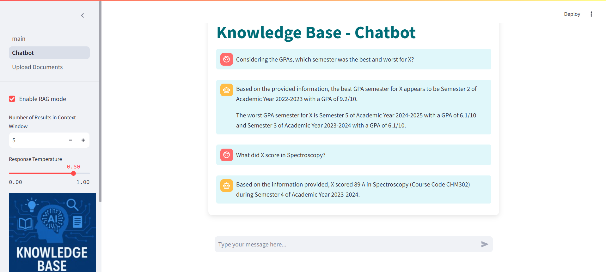
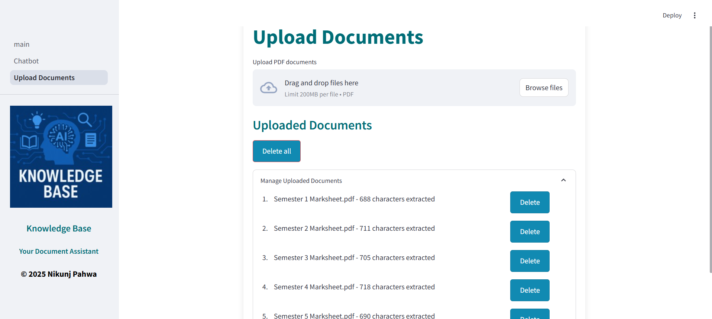

# Knowledge Base Assistant

### Local LLM-based Retrieval-Augmented Generation (RAG) System.
This is a private, offline RAG system for managing and querying personal documents locally using a combination of OpenSearch, Sentence Transformers, and Large Language Models (LLMs). Perfect for anyone seeking a privacy-friendly solution to manage documents without relying on cloud services.

 

 

 

 

## Key Features
- **Privacy-Friendly Document Search:** Search through personal documents without uploading them to the cloud.
- **Hybrid Search with OpenSearch:** Uses both traditional text matching and semantic search.
- **Easy Integration with LLMs:** Leverage local LLMs for personalized, context-aware responses.

## Steps to run:
1. Clone the repo: `git clone https://github.com/nik-o-o/knowledge_base_llm.git`
2. Install dependencies using pip - `pip install -r requirements.txt`
3. Configure `constants.py` for embedding models and OpenSearch settings.
4. Run `streamlit run main.py`
5. Go to `http://localhost:8501` in browser 